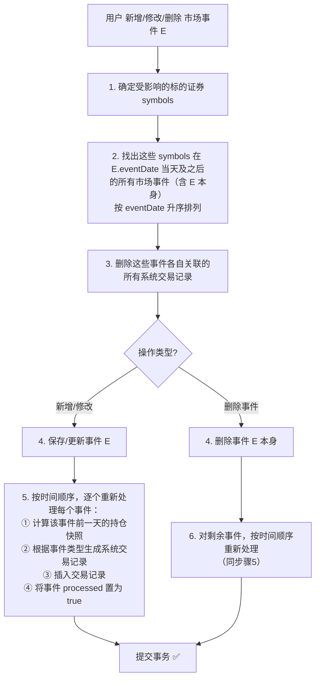
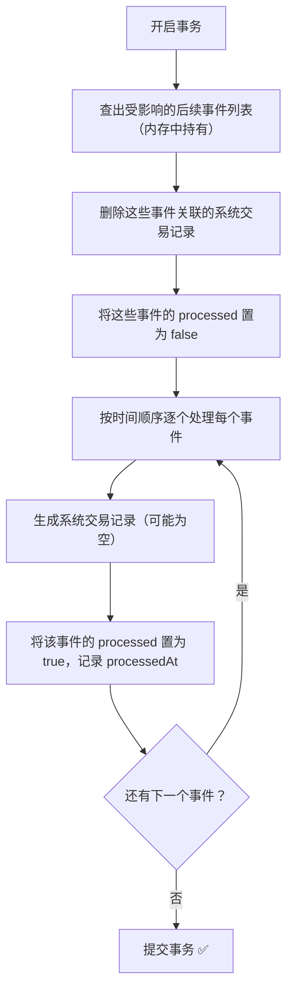

# 市场事件处理方案设计文档

> 创建日期：2026-03-08
> 状态：方案已确认，待实现

---

## 一、背景

当前 `PositionService` 已实现了基于交易记录的基础持仓计算，支持：

- 按 `(symbol, brokerId)` 维度聚合
- 处理 `BUY` / `SELL` / `OPTION_EXPIRE` / `EXERCISE_BUY` / `EXERCISE_SELL` 五种交易类型
- 行权交易对正股的影响

**缺少的部分**：未考虑三类市场事件对持仓的影响。

---

## 二、三类市场事件

系统中已有三类市场事件的数据模型（均继承自 `BaseMarketEvent`）：

| 事件类型 | 实体类 | 数据库表 | 关键字段 | 持仓影响 |
|---------|--------|---------|---------|---------|
| **拆股** | `StockSplitEvent` | `events_stock_split` | `symbol`, `eventDate`, `ratioFrom`, `ratioTo` | 持仓数量按 `ratioTo/ratioFrom` 调整。如 TSLA 1拆3，100股→300股 |
| **代码变更** | `SymbolChangeEvent` | `events_symbol_change` | `symbol`, `eventDate`, `oldSymbol`, `newSymbol` | oldSymbol 的全部持仓转移到 newSymbol。如 FB→META |
| **实物分红** | `DividendInKindEvent` | `events_dividend_in_kind` | `symbol`, `eventDate`, `dividendSymbol`, `dividendQtyPerShare` | 根据持仓数量新增 dividendSymbol 的持仓。如持有1000股A，每股分红0.5股B → 新增500股B |

`BaseMarketEvent` 公共字段：
- `symbol` - 涉及的证券代码
- `symbolName` - 证券名称
- `currency` - 所属市场币种
- `eventDate` - 事件生效日期
- `description` - 事件描述/备注
- `isDeleted` - 软删除标记

---

## 三、方案演进过程

### 3.1 初始方案：时间线混合计算（已否决）

**思路**：将交易记录和市场事件统一按日期排序，形成时间线，顺序遍历处理。

**优点**：
- 天然幂等（纯计算，不修改数据）

**缺点**：
- 每次查持仓都要混合排序 + 多类型分支处理，计算复杂度高
- 需要大幅重构 `PositionService`
- 市场事件的影响是计算过程中的隐式结果，不可审计
- 用户看不到市场事件的具体影响

**结论**：方案可行但复杂，容易出错，已否决。

### 3.2 最终方案：市场事件转交易记录（已采纳）

**思路**：当用户录入一个市场事件时，系统首先计算到市场事件发生的前一天的持仓情况，然后根据持仓情况计算变化，并把变化作为系统交易记录插入到交易记录表中。这类交易记录标记为系统 market event 类型，方便与正常记录区分。

**核心优势**：
1. **关注点分离**：持仓计算只管交易记录，市场事件的处理逻辑独立在事件写入时完成
2. **一次计算，永久生效**：市场事件的影响只在插入时计算一次，后续查持仓零额外开销
3. **数据透明**：用户能清楚看到"为什么我的持仓变了"——因为有一条系统生成的交易记录
4. **PositionService 几乎不用改**：只需新增交易类型即可

---

## 四、最终方案详细设计

### 4.1 核心流程



### 4.2 级联重算机制

**关键边界场景**：当用户补录一个历史市场事件时，该事件发生之后可能已有针对同一标的证券的其他事件。

**示例**：
- 2020-08-31 AAPL 拆股 1:4（已录入，已生成系统交易记录）
- 2023-06-15 AAPL 拆股 1:2（用户现在补录）

如果 2020年的拆股是后补录的，而2023年的拆股已经基于「未拆股」的持仓计算了，则2023年的系统交易记录数量就不正确。

**解决方案**：插入或修改一个历史事件时，必须将针对同一标的证券后续所有事件产生的系统交易记录都删除，然后重新根据事件的先后顺序执行一遍。

### 4.3 事务处理

整个「删除旧交易记录 → 重新生成新交易记录」的过程放在一个数据库事务里，要么全部成功，要么全部回滚。

**安全措施**：
1. **事务保护**：防止处理一半程序挂了，数据一致性得不到保证
2. **先查后删**：在事务开始时，先把需要重新执行的事件列表查出来 hold 在内存中，后续操作都基于这个内存列表，不再依赖中间状态的数据库查询

### 4.4 事件处理状态字段

在市场事件表中增加 `processed` 字段标记已经执行过的事件。

**字段设计**：

| 字段 | 类型 | 说明 |
|------|------|------|
| `processed` | Boolean | 是否已处理（默认 false） |
| `processedAt` | DateTime | 处理时间（可选，便于追溯） |

**语义说明**：使用 `processed`（已处理）而非 `executed`（已执行），因为：
- 有些事件执行后可能**不产生交易记录**（比如拆股事件发生时，用户在该券商根本没有持仓）
- 没有这个字段，就无法区分「这个事件处理过了，只是没有影响」和「这个事件还没被处理」

**在级联重算流程中的使用**：



先置 `false`，再逐个处理后置 `true`，即使事务中途失败回滚，所有状态都会恢复一致。

---

## 五、各事件类型生成的系统交易记录

| 市场事件 | 生成的交易记录 | 示例 |
|---------|-------------|------|
| **拆股 1:3** | 对持有该 symbol 的每个券商，生成一条 `STOCK_SPLIT` 类型的 BUY 记录，数量 = 原持仓 × (ratioTo/ratioFrom - 1) | 持有100股，拆股1:3 → 生成 BUY 200股的记录 |
| **代码变更** | 对持有 oldSymbol 的每个券商，生成两条记录：① oldSymbol SELL 全部持仓 ② newSymbol BUY 同等数量 | FB 100股 → SELL FB 100 + BUY META 100 |
| **实物分红** | 对持有该 symbol 的每个券商，生成一条 dividendSymbol 的 BUY 记录，数量 = 持仓 × dividendQtyPerShare | 持有1000股A，每股分红0.5股B → 生成 BUY B 500股 |

### 5.1 拆股事件详细逻辑

```
输入：StockSplitEvent (symbol, eventDate, ratioFrom, ratioTo)

1. 计算 eventDate 前一天的持仓快照
2. 从持仓快照中筛选出持有该 symbol 的所有 (brokerId, quantity) 记录
3. 对每个持仓记录：
   - 新数量 = quantity × ratioTo / ratioFrom
   - 增量 = 新数量 - quantity  (即 quantity × (ratioTo/ratioFrom - 1))
   - 生成一条系统交易记录：
     * tradeDate = eventDate
     * symbol = event.symbol
     * tradeType = STOCK_SPLIT
     * quantity = 增量（取整，使用 Math.round()）
     * price = 0
     * amount = 0
     * fee = 0
     * brokerId = 持仓的 brokerId
     * 关联 marketEventId + marketEventType
```

**碎股处理**：拆股后可能出现小数（如持有1股时1拆3），使用 `Math.round()` 取整。

### 5.2 代码变更详细逻辑

```
输入：SymbolChangeEvent (symbol, eventDate, oldSymbol, newSymbol)

1. 计算 eventDate 前一天的持仓快照
2. 从持仓快照中筛选出持有 oldSymbol 的所有 (brokerId, quantity) 记录
3. 对每个持仓记录，生成两条系统交易记录：
   a) SELL oldSymbol：
     * tradeDate = eventDate
     * symbol = oldSymbol
     * tradeType = SYMBOL_CHANGE
     * quantity = 原持仓数量（SELL 方向）
     * price = 0, amount = 0, fee = 0
   b) BUY newSymbol：
     * tradeDate = eventDate
     * symbol = newSymbol
     * tradeType = SYMBOL_CHANGE
     * quantity = 原持仓数量（BUY 方向）
     * price = 0, amount = 0, fee = 0
   * 两条记录均关联 marketEventId + marketEventType
```

### 5.3 实物分红详细逻辑

```
输入：DividendInKindEvent (symbol, eventDate, dividendSymbol, dividendQtyPerShare)

1. 计算 eventDate 前一天的持仓快照
2. 从持仓快照中筛选出持有该 symbol 且 quantity > 0 的所有记录
3. 对每个持仓记录：
   - 分红数量 = (int)(quantity × dividendQtyPerShare)（向下取整，与券商碎股处理一致）
   - 生成一条系统交易记录：
     * tradeDate = eventDate
     * symbol = dividendSymbol
     * tradeType = DIVIDEND_IN_KIND
     * quantity = 分红数量
     * price = 0, amount = 0, fee = 0
     * brokerId = 持仓的 brokerId
     * 关联 marketEventId + marketEventType
```

---

## 六、数据模型变更

### 6.1 TradeType 枚举扩展

在 `TradeType` 枚举中新增三种类型：

```java
public enum TradeType {
    BUY,            // 买入
    SELL,           // 卖出
    OPTION_EXPIRE,  // 期权到期
    EXERCISE_BUY,   // 行权买股
    EXERCISE_SELL,  // 行权卖股
    // ↓ 新增：市场事件生成的系统交易类型
    STOCK_SPLIT,      // 拆股调整
    SYMBOL_CHANGE,    // 代码变更
    DIVIDEND_IN_KIND  // 实物分红
}
```

> 注意：数据库的 `trade_type_enum` 也需要同步添加这三个值。

### 6.2 TradeRecord 表扩展

在 `trade_records` 表中新增字段，用于关联源市场事件：

| 字段 | 类型 | 说明 |
|------|------|------|
| `market_event_id` | Long (nullable) | 关联的市场事件 ID |
| `market_event_type` | String (nullable) | 市场事件类型：`STOCK_SPLIT` / `SYMBOL_CHANGE` / `DIVIDEND_IN_KIND` |

这两个字段的用途：
1. **反向追溯**：从交易记录可以查到是哪个市场事件生成的
2. **清理机制**：修改/删除市场事件时，通过 `market_event_id` + `market_event_type` 找到并删除关联的系统交易记录

### 6.3 BaseMarketEvent 表扩展

在三个市场事件表中新增：

| 字段 | 类型 | 说明 |
|------|------|------|
| `processed` | Boolean | 是否已处理（默认 false） |
| `processed_at` | DateTime (nullable) | 处理时间 |

---

## 七、受影响的 symbols 确定规则

不同事件类型确定受影响 symbols 的规则：

| 事件类型 | 受影响的 symbols |
|---------|----------------|
| **拆股** | 拆股的 symbol |
| **代码变更** | `oldSymbol` 和 `newSymbol`（后续事件中引用这两个 symbol 的都要重算） |
| **实物分红** | 原始 symbol 和 `dividendSymbol` |

---

## 八、PositionService 的影响

由于市场事件的影响已经被转化为系统交易记录，`PositionService.calculatePositions()` 方法**几乎不需要修改**。

唯一需要确认的是：在 `calculateQuantityDelta()` 方法中，新增的三种交易类型需要被正确处理：

- `STOCK_SPLIT`：quantity 直接作为增量加到持仓上（已经是计算好的增量）
- `SYMBOL_CHANGE`：作为 BUY/SELL 处理（生成的记录中已经包含了方向信息）
- `DIVIDEND_IN_KIND`：quantity 直接作为增量（买入分红证券）

实际上，由于生成的系统交易记录的 `tradeType` 就是 `STOCK_SPLIT`、`SYMBOL_CHANGE`、`DIVIDEND_IN_KIND`，需要在 `calculateQuantityDelta()` 中添加对这三种类型的处理逻辑。

---

## 九、前端影响

**前端无需修改持仓快照功能**。市场事件的处理完全在后端完成，`GET /api/positions` 的接口入参和出参保持不变。

在交易记录列表中，系统生成的记录（tradeType 为 `STOCK_SPLIT` / `SYMBOL_CHANGE` / `DIVIDEND_IN_KIND`）可以通过前端进行特殊标记展示（如添加"系统生成"标签），方便用户识别。

---

## 十、边界情况与防护

| 场景 | 处理策略 |
|------|---------|
| 同一 symbol 多次拆股 | 级联重算机制保证按时间顺序依次处理，每次基于前一天的正确持仓 |
| 代码变更链（A→B→C） | 依次处理，A→B 后 A 的持仓归入 B，后续 B→C 时 B（含原 A）都归入 C |
| 拆股+代码变更同一天 | 按事件 ID 或时间戳排序确定先后顺序 |
| 分红数量为小数 | 向下取整（`Math.floor`），与券商碎股处理行为一致 |
| 拆股导致的碎股 | 使用 `Math.round()` 取整 |
| 没有录入市场事件 | 回退到现有行为，不影响基础交易持仓计算 |
| 事件处理时无持仓 | `processed` 标记为 true，但不生成系统交易记录（"处理过了，但无影响"） |
| 事务中途失败 | 整个操作回滚，`processed` 状态恢复一致 |
| 删除市场事件后有后续事件 | 删除后仍需级联重算后续事件（基础持仓变了） |

---

## 十一、方案决策记录

| 日期 | 决策 | 原因 |
|------|------|------|
| 2026-03-08 | 否决"时间线混合计算"方案 | 过于复杂，每次查持仓都要混合排序 + 多类型分支处理，容易出错 |
| 2026-03-08 | 采纳"市场事件转交易记录"方案 | 关注点分离，持仓计算逻辑简单统一，写入时一次性处理 |
| 2026-03-08 | 确认级联重算机制 | 补录历史事件时，后续事件的基础持仓会变化，必须重算 |
| 2026-03-08 | 确认使用数据库事务保护 | 防止处理一半程序崩溃导致数据不一致 |
| 2026-03-08 | 确认增加 `processed` 字段 | 区分"未处理"和"处理后无影响"两种状态，运维友好 |
| 2026-03-08 | 使用 `processed` 而非 `executed` 命名 | 更准确表达语义：有些事件处理后不产生交易记录 |
